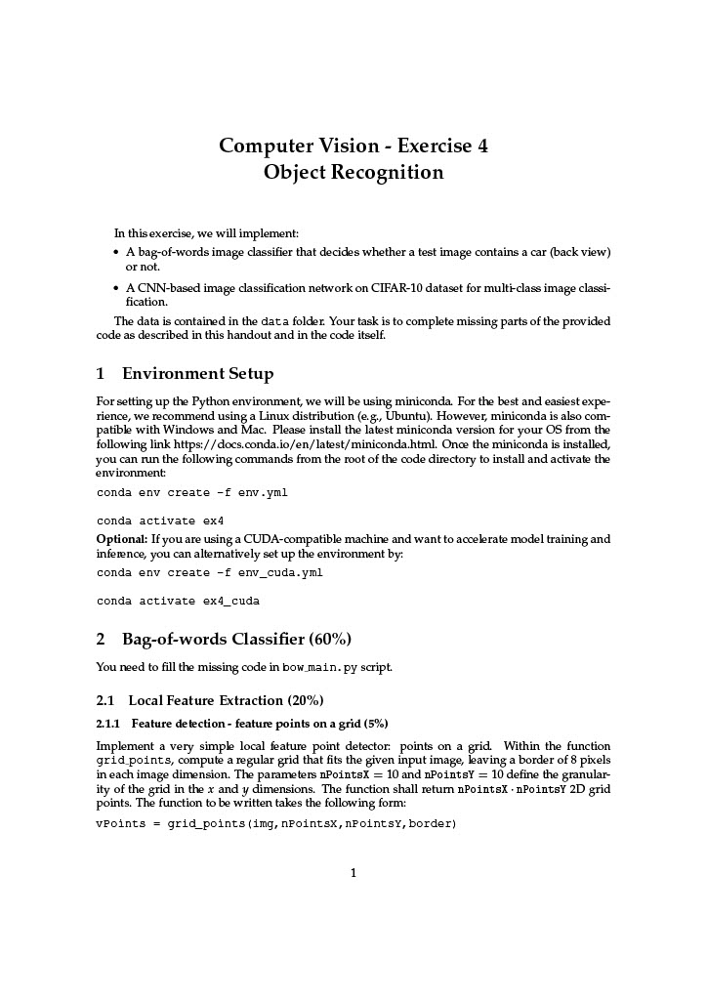
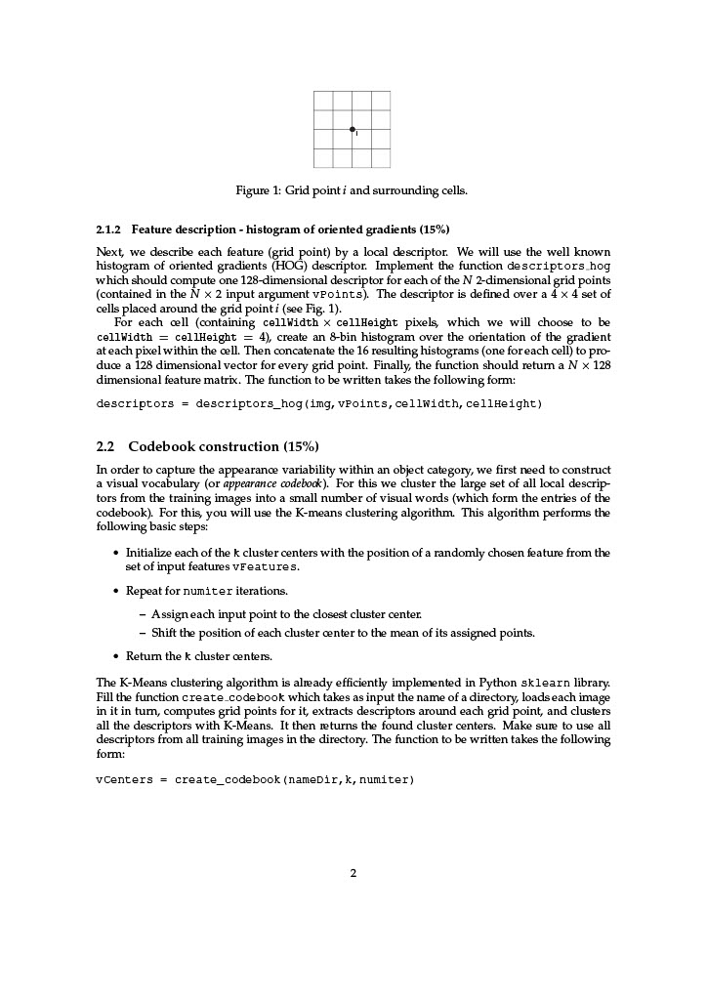
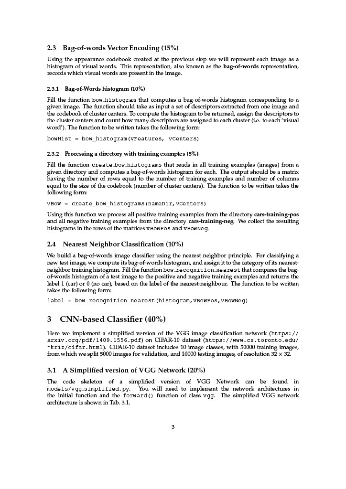
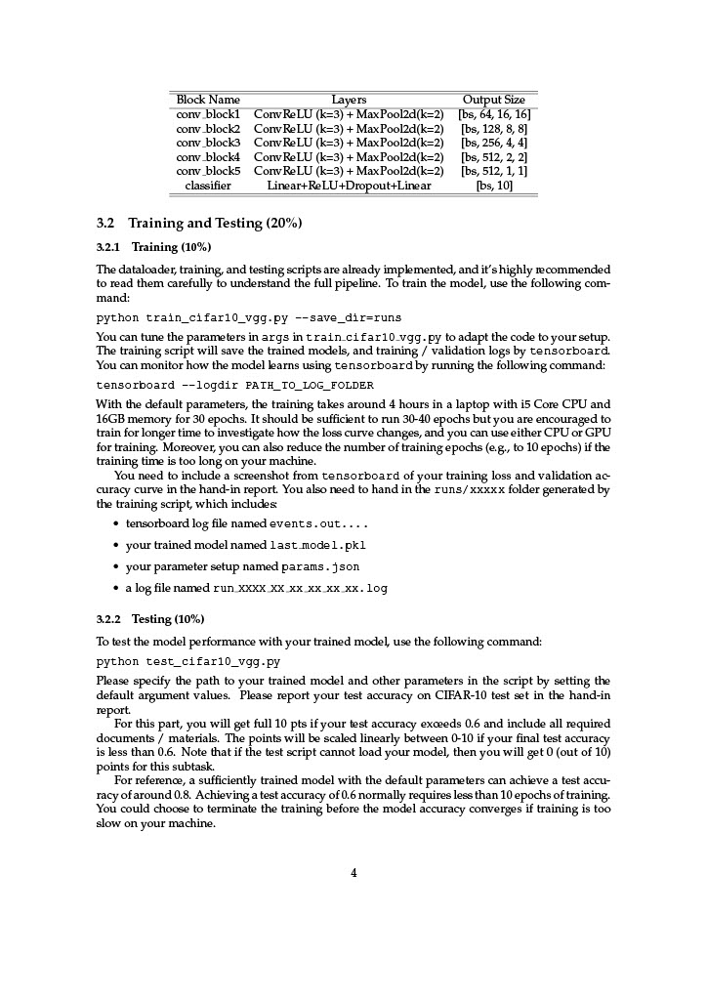

# Lab 3: Object Recognition

## Overview
This lab focused on using Bag-of-Words and then CNN-based methods to classify images. The CNN architecture is a simplified
version of **VGG Network** and is trained on the CIFAR-10 dataset.

My report can be found [here](CV_Lab_03_Object_Classification.pdf).

## Lab brief

 </img>
 </img>
 </img>
 </img>
 </img>
